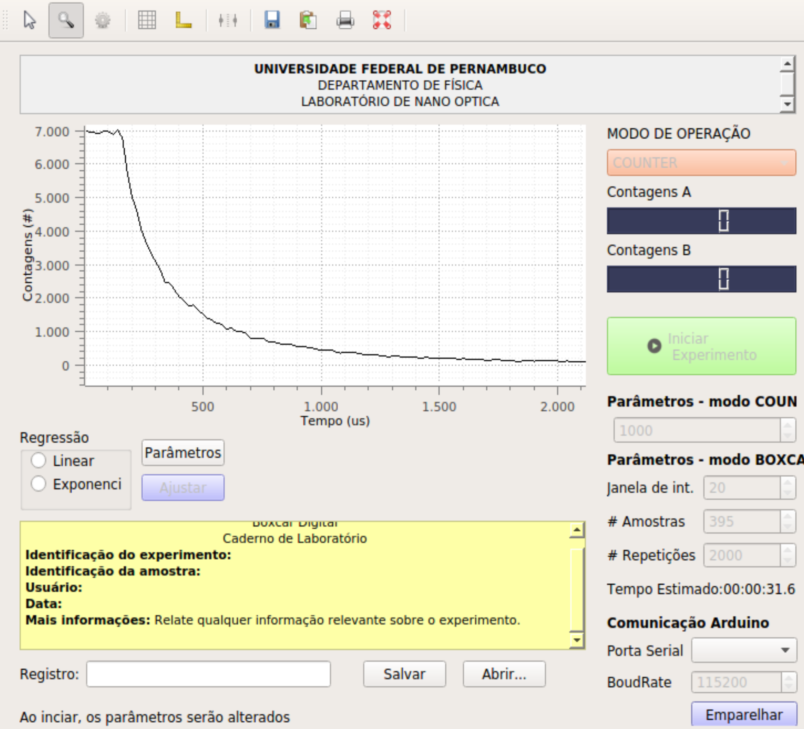

# Boxcar Integrator
This is a graphical user interface for a Boxcar averager (integrator), which performs time-resolved measurements from an Arduino-based Time-Correlated Single Photon Counter (project can be found [here](https://github.com/AllisonPessoa/Arduino-TCSPC)). The communication with the hardware is done via Serial (USB), either for recieving new acquired data, or for changing the instrument acquision parameters. 

A boxcar integrator works by integrating the signal input during a well-determined amount of time (gate width), after waiting a determined delay time triggered by an external source. This is done by a Arduino-based Time-Correlated Single Photon Counter.

The GUI is based on PyQt5 and the plots are helped with guiqwt.
